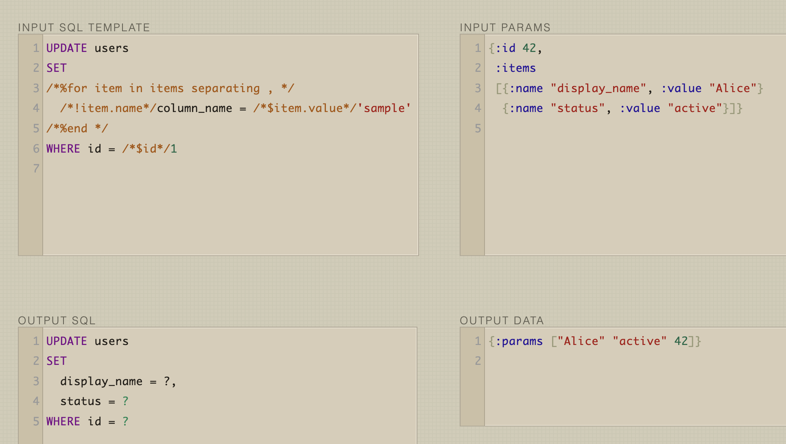

# Bisql

  

<code>bisql</code> (<code>báisikl</code>)

Executable SQL as Clojure functions, with generated CRUD queries and SQL-first development.

- Query templates remain valid, executable SQL.
- Typical index-friendly queries are generated automatically, as comprehensively as possible.

No query builder  
No data mapper  
No hidden SQL  
No boilerplate SQL  

Start a database, run the generation commands, add `(defquery)`, and you can immediately call query functions from your Clojure code. Every function still corresponds to real SQL.

> [!NOTE]
> This project is still early and the API may change.
> Support for databases beyond PostgreSQL and Malli integration are both planned.

## Getting Started

The full Getting Started guide lives here:

- [docs/03-getting-started.md](docs/03-getting-started.md)
- [https://hatappo.github.io/bisql/docs/getting-started/](https://hatappo.github.io/bisql/docs/getting-started/)

## Installation

The full Installation guide lives here:

- [docs/02-installation.md](docs/02-installation.md)
- [https://hatappo.github.io/bisql/docs/installation/](https://hatappo.github.io/bisql/docs/installation/)

## Malli Validation

- Generated CRUD SQL carries `:malli/in` and `:malli/out` declaration metadata.
- When generated query functions keep `:malli/in` and `:malli/out` metadata, Bisql can run Malli validation transparently during query execution.

The full guide lives here:

- [docs/12-malli-validation.md](docs/12-malli-validation.md)
- [https://hatappo.github.io/bisql/docs/malli-validation/](https://hatappo.github.io/bisql/docs/malli-validation/)

## Quick Example

See the end-to-end sample project here:

- [https://github.com/hatappo/bisql-example](https://github.com/hatappo/bisql-example)

It shows a practical flow:

- generate CRUD SQL from a PostgreSQL schema
- generate matching function namespace files
- execute one generated query
- copy one generated query into a hand-written SQL template
- execute the customized query

## Development

For local setup, tasks, and dev workflow, see:

- [docs/dev-local-development.md](docs/dev-local-development.md)

## Ideas Under Consideration

- ✅️ ~~Support a very small expression language to improve expressiveness in `if` conditions.~~
- ✅️ ~~Add Malli integration.~~
- Split Malli validation dependencies out from the main runtime package.
- Add sentinels for SQL time literals such as `CURRENT_DATE`, `CURRENT_TIME`, and `CURRENT_TIMESTAMP`.
- Split the CLI into a separate package.
  - Add `rewrite-clj` as a CLI-side dependency and implement pruning for unused generated vars.
- Support databases beyond PostgreSQL.
- Compile analyzed SQL templates into reusable renderer functions for lower runtime overhead.
  - Simplify emitted renderer forms further, especially around branch and loop body handling.
  - Reduce helper calls in emitted code where fragment normalization is still delegated.
  - Restrict `bisql/DEFAULT` to valid SQL value contexts if context-aware rendering becomes necessary.
  - Detect dangerous `nil` comparisons consistently in `WHERE` / `HAVING` clauses instead of letting expressions such as `= NULL`, `LIKE NULL`, or `IN (NULL)` silently behave unexpectedly. This likely needs stricter SQL context parsing, because `= NULL` is dangerous in `WHERE` / `HAVING` but can still be valid assignment syntax in `SET`.
